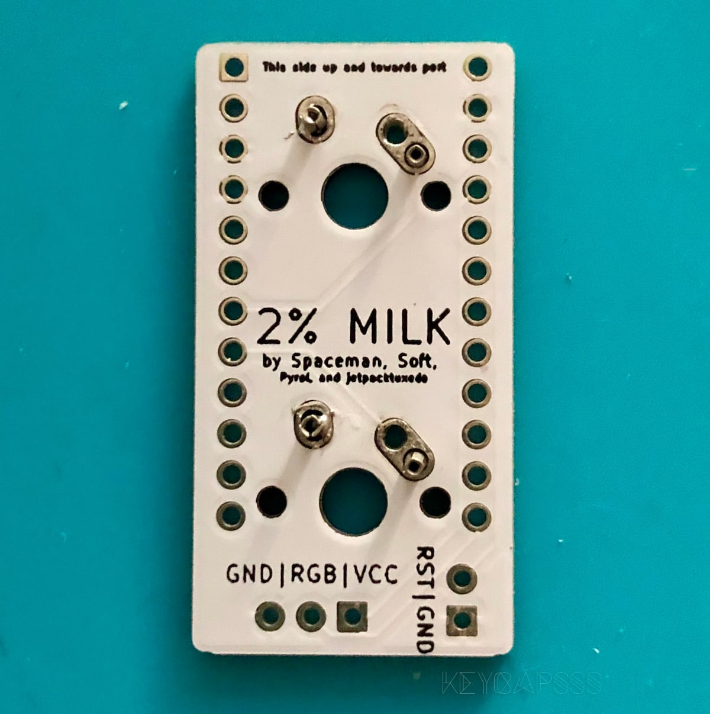
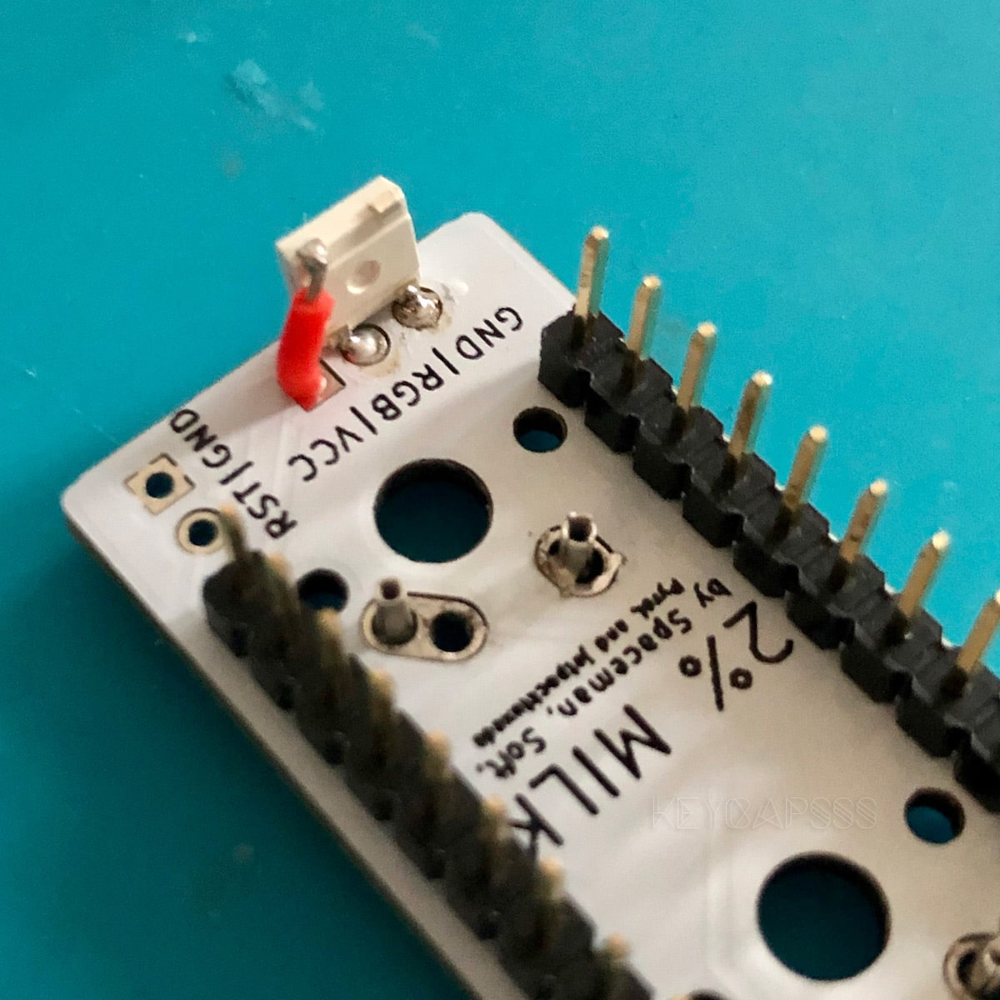
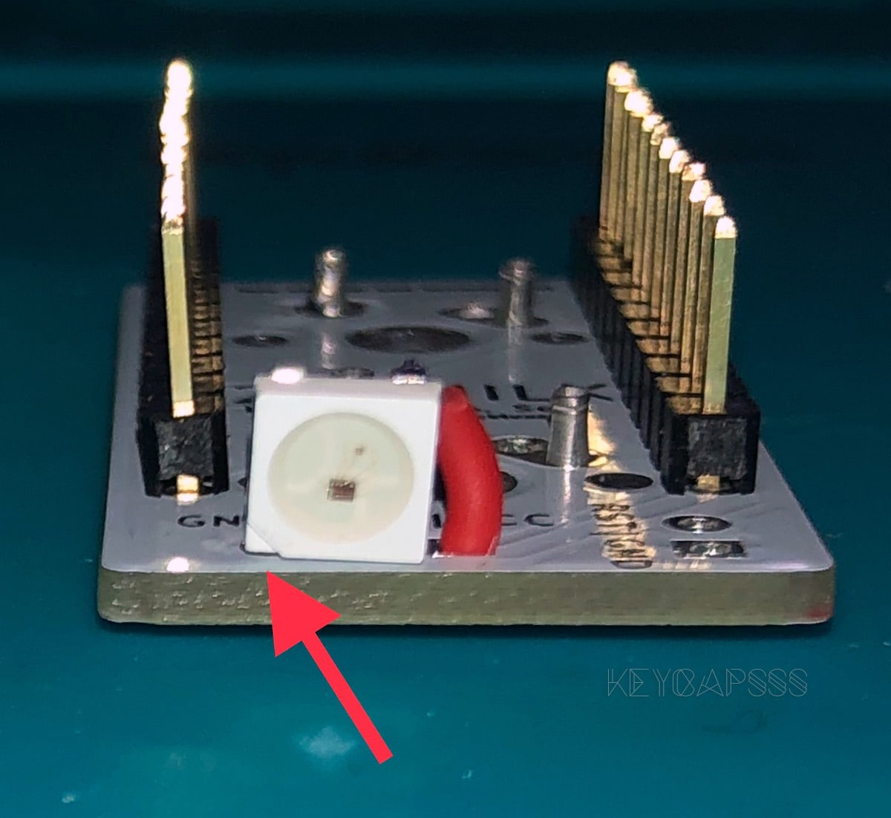
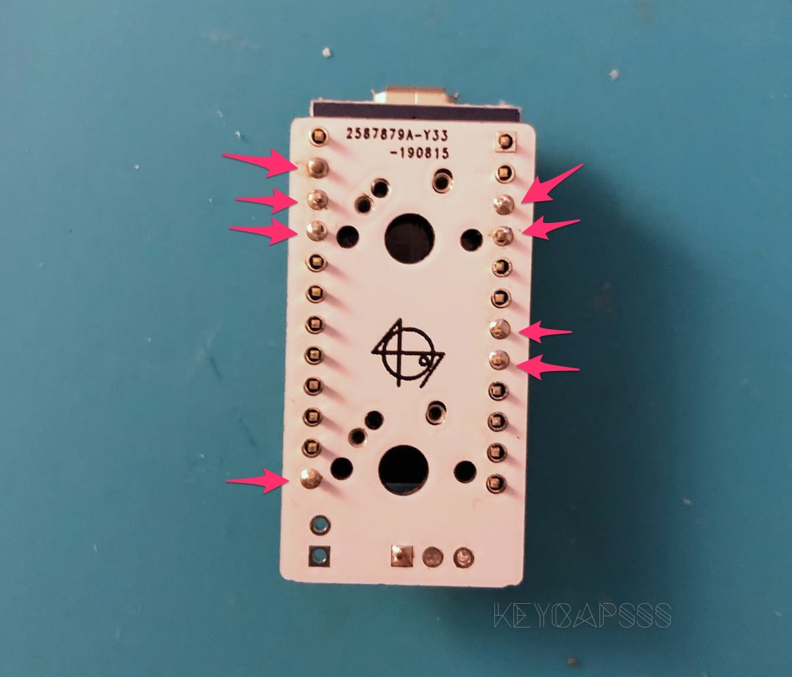
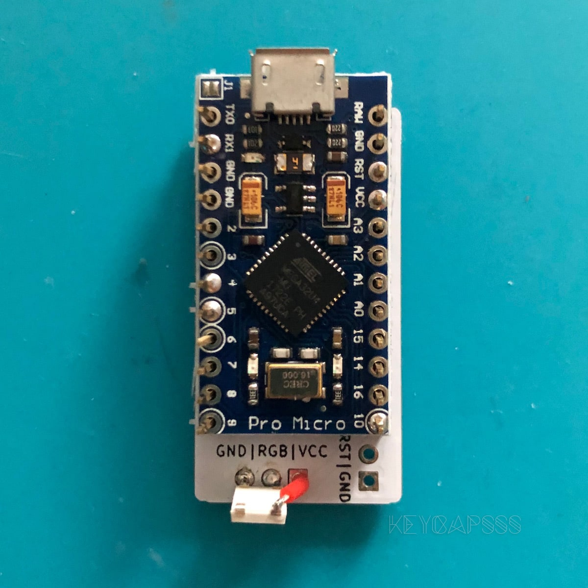
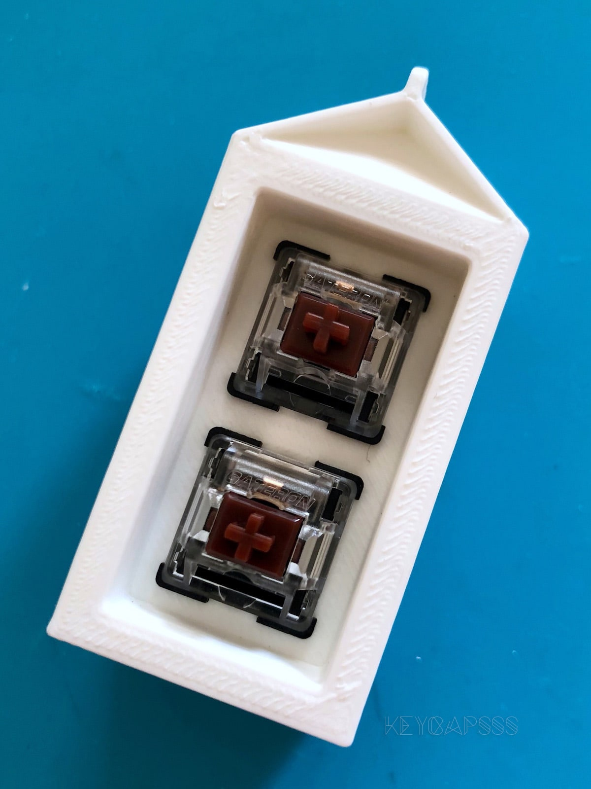

# Build guide for the 2% Milk 2-Key Macropad

- Hardware Availability: [Open Source](https://github.com/Rionlion100/Spaceboards/tree/master/Keyboards/2%25%20Milk), [Keycapsss](https://keycapsss.com/diy-kits/88/2-milk-2-key-macro-pad)
- [QMK firmware page](https://github.com/qmk/qmk_firmware/tree/master/keyboards/2_milk)

### 1: Solder the Mill-Max Hotswap Sockets


### 2: (Optional) Solder the WS2812B RGB Led



### 3: Solder the header pins for the Pro Micro 



### 4: Install the switches to the 3d printed case


### 5: Install the Pro Micro to the back of the 3d printed case


## Build Firmware
Make example for this keyboard (after setting up your build environment):

```bash
make 2_milk:default
```

See the [build environment setup](https://docs.qmk.fm/#/getting_started_build_tools) and the [make instructions](https://docs.qmk.fm/#/getting_started_make_guide) for more information. Brand new to QMK? Start with our [Complete Newbs Guide](https://docs.qmk.fm/#/newbs).

## Credits

- Case made by Soft
- PCB made by PyroL