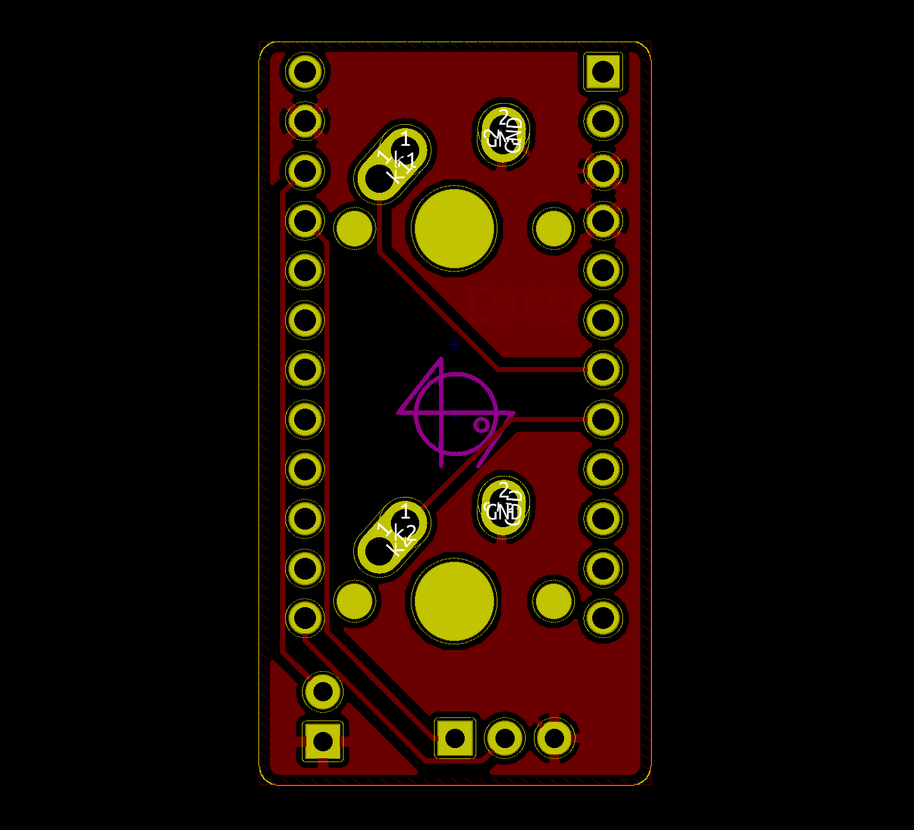

[](https://github.com/firstcontributions/first-contributions)
# Build guide for the 2% Milk 2-Key Macropad

- Hardware Availability: [Open Source](https://github.com/Rionlion100/Spaceboards/tree/master/Keyboards/2%25%20Milk), [Keycapsss](https://keycapsss.com/diy-kits/88/2-milk-2-key-macro-pad)
- [QMK firmware page](https://github.com/qmk/qmk_firmware/tree/master/keyboards/spaceman/2_milk)

### 1: Solder the Mill-Max Hotswap Sockets


### 2: (Optional) Solder the WS2812B RGB Led


### 3: Solder the header pins for the Pro Micro
It's not necessary to solder all pins.  
The marked pins are used by the milk pcb.


Pcb bottom view.


### 4: Install the switches to the 3d printed case


### 5: Install the Pro Micro to the back of the 3d printed case


## Build Firmware
Make example for this keyboard (after setting up your build environment):

```bash
make spaceman/2_milk:default
```
or
```bash
qmk compile -kb spaceman/2_milk -km default
```
Then use [QMK Toolbox](https://github.com/qmk/qmk_toolbox) to flash the firmware on the Pro Micro.  
Before connect RST and GND pins with a paper clip or tweezers, to bring the Pro Micro into the Bootloader Mode.


See the [build environment setup](https://docs.qmk.fm/#/getting_started_build_tools) and the [make instructions](https://docs.qmk.fm/#/getting_started_make_guide) for more information. Brand new to QMK? Start with our [Complete Newbs Guide](https://docs.qmk.fm/#/newbs).

## Credits

- Case made by Soft
- PCB made by PyroL
